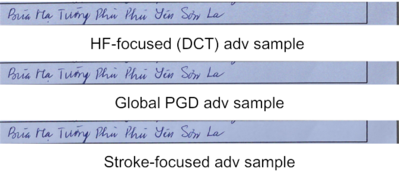

# Adversarial Robustness Evaluation of a Vietnamese Handwriting OCR System

This repository demonstrates adversarial attacks on an OCR model using **Projected Gradient Descent (PGD)**. The goal is to evaluate and reduce the robustness of OCR systems by generating adversarial perturbations using three different strategies:

- **Global PGD**
- **HF-Focused PGD**
- **Stroke-Focused PGD**



## Repository Structure

```
Adversarial_Attack_OCR/
├── data/Train/             # Training dataset (images + labels)
├── train_vietocr.py        # Script to train the VietOCR model
├── attack_PGD.py           # PGD attack script for Global and HF-Focused variants
├── Stroke_focused.py       # PGD attack script for Stroke-Focused variant
├── README.md               # Project documentation
```

## Attack Variants

### 1. Global PGD

- Implemented in: `attack_PGD.py`
- Perturbs the **entire image uniformly**
- Serves as the **baseline** PGD attack

### 2. HF-Focused PGD

- Also in: `attack_PGD.py`
- Perturbs only **high-frequency regions** such as edges and textures
- Requires setting `"hf_focus"` inside the script

### 3. Stroke-Focused PGD

- Implemented in: `Stroke_focused.py`
- Perturbs only the **character stroke regions**
- Designed for more **localized and stealthy** adversarial perturbations

> To switch between Global and HF-Focused PGD, edit the `attack_method` variable inside `attack_PGD.py`:

## Usage Instructions

### 1. Install Dependencies

```bash
pip install torch torchvision vietocr opencv-python numpy
```

### 2. Train the OCR Model

```bash
python train_vietocr.py
```

> You may need to modify data paths inside the script depending on your setup.

### 3. Run Global or HF-Focused PGD Attack

```bash
python attack_PGD.py
```

- Make sure to set the desired inside the script (`"global"` or `"hf_focus"`)

### 4. Run Stroke-Focused PGD Attack

```bash
python Stroke_focused.py
```

## Attack Parameters

Each PGD attack can be configured with the following hyperparameters:

- `epsilon`: Maximum perturbation magnitude (L∞ norm)
- `steps`: Number of PGD iterations
- `step-size`: Step size for each PGD step

> You can either pass these via CLI (if implemented) or modify directly inside the script.

## Evaluation Metrics (Optional)

If you wish to evaluate the impact of attacks on model performance:

- **Character Error Rate (CER)**
- **Word Error Rate (WER)**
- **Sequence Error Rate (SER)**

These can be computed by comparing predictions on clean vs. adversarial images.

### Evaluation Results

| Method         | CER (Orig.) | CER (Attk.) | WER (Orig.) | WER (Attk.) | SER (Orig.) | SER (Attk.) | Acc/Char (Orig.) | Acc/Char (Attk.) | Full Acc (Orig.) | Full Acc (Attk.) |
|----------------|-------------|-------------|-------------|-------------|-------------|-------------|------------------|------------------|------------------|------------------|
| Stroke-Focused | 0.012       | 0.025       | 0.027       | 0.073       | 0.169       | 0.070       | 0.983            | 0.9543           | 0.831            | 0.425            |
| HF-Focused     | 0.012       | 0.0329      | 0.027       | 0.0936      | 0.169       | 0.463       | 0.983            | 0.9651           | 0.831            | 0.4172           |
| Global PGD     | 0.012       | 0.0245      | 0.027       | 0.0723      | 0.169       | 0.3667      | 0.983            | 0.9655           | 0.831            | 0.632            |


### HF-Focused Attack Performance Across Different ϵ Levels

| Epsilon | CER (Orig.) | CER (Attk.) | WER (Orig.) | WER (Attk.) | SER (Orig.) | SER (Attk.) | Acc/Char (Orig.) | Acc/Char (Attk.) | Full Acc (Orig.) | Full Acc (Attk.) |
|---------|-------------|-------------|-------------|-------------|-------------|-------------|------------------|------------------|------------------|------------------|
| 0.05    | 0.012       | 0.0329      | 0.027       | 0.0936      | 0.169       | 0.463       | 0.983            | 0.9561           | 0.831            | 0.4172           |
| 0.1     | 0.012       | 0.0353      | 0.027       | 0.0991      | 0.169       | 0.4741      | 0.983            | 0.9532           | 0.831            | 0.3957           |
| 0.2     | 0.012       | 0.0391      | 0.027       | 0.1119      | 0.169       | 0.5444      | 0.983            | 0.9422           | 0.831            | 0.3897           |
| 0.3     | 0.012       | 0.0896      | 0.027       | 0.1971      | 0.169       | 0.7741      | 0.983            | 0.9125           | 0.831            | 0.2259           |


## Citation
If you use our work, please cite it as below:
```bibtext
@inproceedings{HuynhLuongDuongPhanMAPR2025,
  author    = {Thai Bao Huynh, Ngoc Hoang Luong, Viet-Hang Duong, Quan Minh Phan},
  title     = {{Adversarial Robustness Evaluation of a Vietnamese Handwriting OCR System}},
  booktitle = {MAPR 2025: 2025 International Conference on Multimedia Analysis and Pattern Recognition},
  address   = {Nha Trang, Vietnam},
  publisher = {{ACM}},
  year      = {2025}
}
```

## Acknowledgements
- All attacks are **white-box**, using gradients from the trained OCR model.
- The OCR model is based on [VietOCR](https://github.com/pbcquoc/vietocr).
- Dataset used: Kalapa Bytebattles 2023 - Vietnamese Handwritten Recognition [Dataset](https://challenge.kalapa.vn/portal/handwritten-vietnamese-text-recognition/overview).
